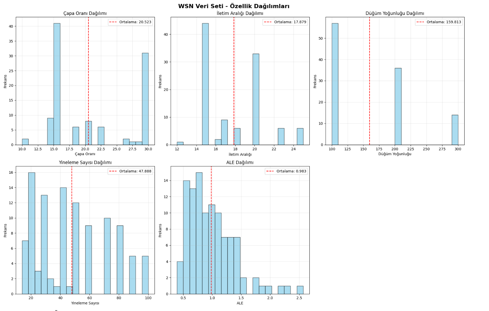
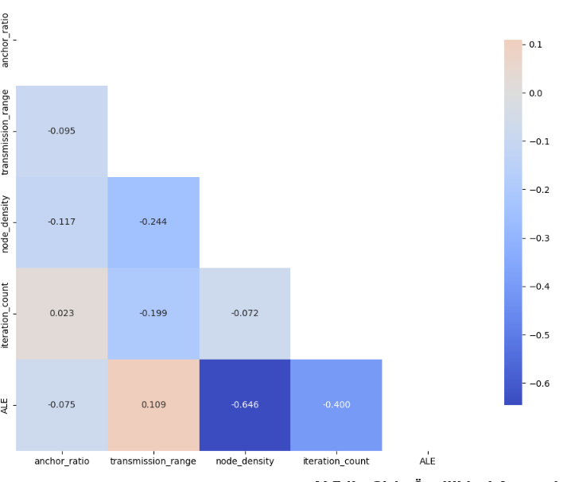
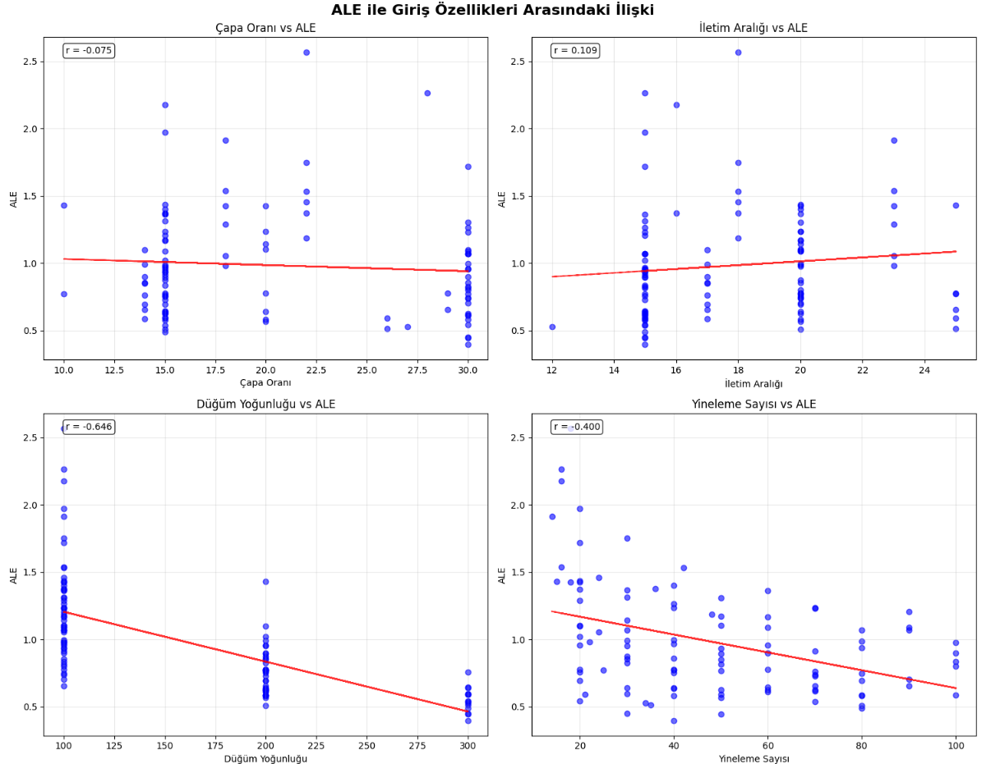
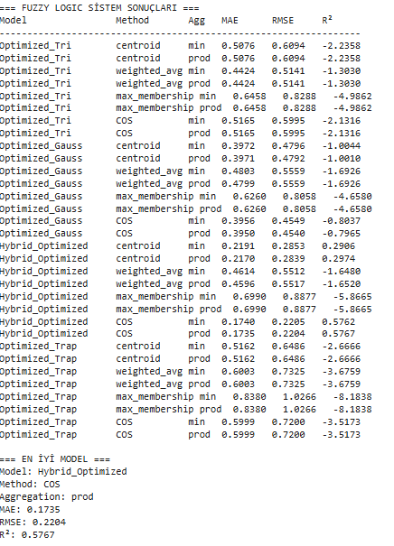
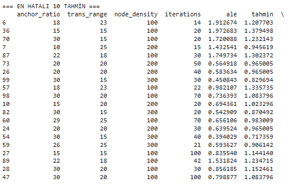
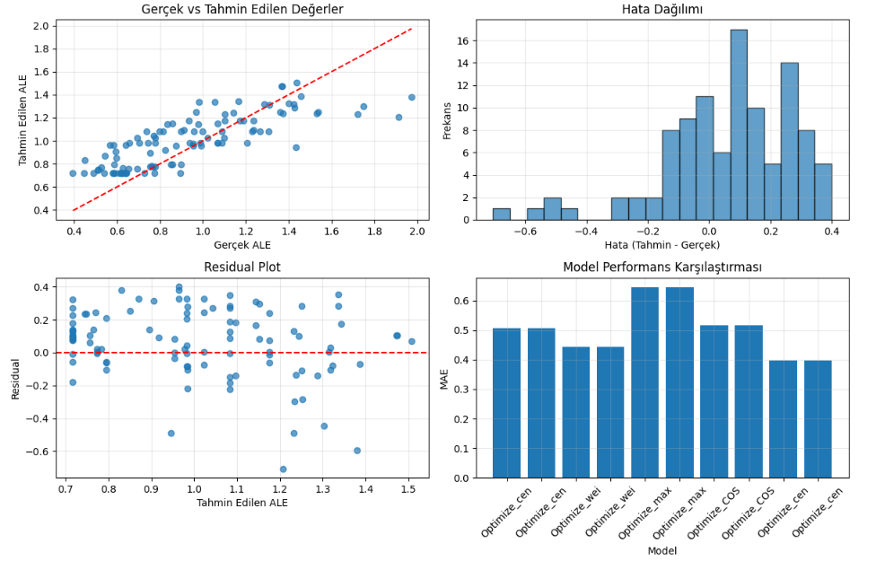

# WSN Kablosuz Sensör Ağları - Bulanık Mantık Analiz Sistemi

## 📋 Genel Bakış

Bu proje, Kablosuz Sensör Ağlarında (Wireless Sensor Networks - WSN) Ortalama Lokalizasyon Hatası (ALE - Average Localization Error) tahminini yapmak için geliştirilmiş kapsamlı bir bulanık mantık sistemidir. Proje iki ana modülden oluşur:

1. **Veri Analizi Modülü**: Veri yükleme, temizleme, analiz ve görselleştirme
2. **Bulanık Mantık Sistemi**: Çoklu üyelik fonksiyonları ve defuzzification yöntemleri ile ALE tahmini

## 📁 Proje Yapısı
```
Bulanik_Mantik_Tabanli_ALE_Tahmin_Modeli/
│
├── veri_analizi.py        # Veri analizi modülü
├── fuzzy_sistem.py         # Bulanık mantık sistemi
├── veri.csv                    # Veri dosyası
├── README.md                   # Bu dosya

```

## 🔧 Gereksinimler

### Gerekli Python Kütüphaneleri
```
pandas >= 1.3.0
numpy >= 1.21.0
matplotlib >= 3.4.0
seaborn >= 0.11.0
scikit-learn >= 1.0.0
```

### Kurulum
```bash
pip install pandas numpy matplotlib seaborn scikit-learn
```

## 📊 Veri Seti Formatı

### CSV Dosya Yapısı
Sistem aşağıdaki sütunları içeren CSV dosyalarını işler:

1. **anchor_ratio**: Çapa oranı (10-30 arası)
2. **trans_range**: İletim aralığı (12-25 arası)
3. **node_density**: Düğüm yoğunluğu (100, 200, 300)
4. **iterations**: Yineleme sayısı (14-100 arası)
5. **ale**: Average Localization Error - Hedef değişken (0.39-2.57 arası)


### Veri Özellikleri
- **Beklenen satır sayısı**: 107
- **Sütun sayısı**: 5
- **Veri tipi**: Tüm sütunlar sayısal
- **Hedef değişken**: ALE değeri 

## 🚀 Kullanım

### 1. Temel Veri Analizi
```python
# Veri yükleme ve analizi
veri_analizi.py dosyası çalıştırılarak veriler analiz edilir


```

### 2. Bulanık Mantık Sistemi
```python

# Fuzzy sistemin çalıştırılması
fuzzy_sistem.py dosyası çalıştırılarak model sonuçları alınarak 32 adet sonuçtan en iyi model tespit edilir.
```


## 🧠 Bulanık Mantık Sistemi Özellikleri

### 1. Üyelik Fonksiyonları

| Fonksiyon       | Parametreleri      | Nasıl Tespit Edilir?                              |
| --------------- | ------------------ | ------------------------------------------------- |
| **Triangular**  | `a`, `b`, `c`      | a: min, b: ortalama/medyan, c: max                |
| **Trapezoidal** | `a`, `b`, `c`, `d` | a: alt sınır, b–c: çoğunluk bölgesi, d: üst sınır |
| **Gaussian**    | `μ`, `σ`           | μ: ortalama, σ: standart sapma                    |
| **Hybrit**      |                    | karma üyelik fonksiyonları kullanılır             |
- Üyelik fonksiyon parametreleri yukarıdaki gibi belirlenmiştir .Daha sonrasında veri analizindeki ale değerleri ile sutunların ilişkilerine bakılarak ve tahmin değerindeki artışa göre değerler optimize edilmiştir

#### Optimized Triangular (Üçgen)
- **Anchor Ratio**: low(7-15-18), medium(15-18-30), high(18-30-33)
- **Trans Range**: low(10-15-17), medium(15-17-20), high(17-20-27)
- **Node Density**: low(70-100-200), medium(100-200-300), high(200-300-330)
- **Iterations**: low(1-30-40), medium(30-40-70), high(40-70-113)

#### Optimized Gaussian (Gauss)
- **Anchor Ratio**: low(μ=14.6, σ=1.0), medium(μ=20.0, σ=1.1), high(μ=29.6, σ=1.5)
- **Trans Range**: low(μ=15.3, σ=0.9), medium(μ=19.7, σ=0.7), high(μ=24.0, σ=1.0)
- **Iterations**: low(μ=23.9, σ=7.8), medium(μ=48.6, σ=10.8), high(μ=81.7, σ=6.0)

#### Hybrid Optimized (Hibrit)
- Üçgen, Gauss ve Yamuk fonksiyonların optimal kombinasyonu
- En iyi performans için özelleştirilmiş

#### Optimized Trapezoidal (Yamuk)
- Daha yumuşak geçişler için yamuk üyelik fonksiyonları

### 2. Kural Tabanı (18 Kural)

Korelasyon analizi sonuçlarına göre optimize edilmiş kurallar:
-	Her kural için önem ağırlığı 1.0 ile 5.0 arasında tanımlanmıştır.
-	Ağırlıklandırma sürecinde şu kriterler dikkate alınmıştır:
-	Korelasyon Katsayıları: Değişkenlerin ale ile olan ilişkisi doğrudan dikkate alınarak, yüksek mutlak korelasyon değerine sahip değişkenler içeren kurallara daha yüksek ağırlıklar verilmiştir.
-	Kombinasyon Gücü: Birden fazla değişkeni içeren ve birlikte anlamlı sonuçlar üreten kurallar, tek değişkene dayanan kurallara kıyasla daha yüksek ağırlıkla tanımlanmıştır.
-	Veri Dağılımı ve Temsil Gücü: Sıkça rastlanan değer aralıklarını kapsayan kurallara daha yüksek öncelik verilmiştir.
-	Bu sayede, sistemin hem doğruluğu hem de genellenebilirliği artırılmıştır.
-	Korelasyon analizi ve sezgisel bilgiden faydalanılarak toplam 18 adet kural tanımlanmıştır.
-	Her kural: antecedent (koşullar), consequent (sonuç) ve ağırlık içerir.

```python
# Örnek kurallar
({"node_density": "low", "iterations": "low"}, "high", 5.0)
({"iterations": "high", "node_density": "high"}, "low", 2.0)
({"anchor_ratio": "high", "trans_range": "high"}, "low", 1.0)
```

### 3. Defuzzification Yöntemleri

1. **Centroid (Ağırlık Merkezi)**: Klasik ağırlık merkezi yöntemi
2. **Weighted Average (Ağırlıklı Ortalama)**: Hızlı hesaplama
3. **Max Membership (Maksimum Üyelik)**: En yüksek aktivasyonlu sınıf
4. **Center of Sums (COS)**: Gelişmiş ağırlık merkezi

### 4. Agregasyon Yöntemleri
- **MIN**: Minimum operatörü 
- **PROD**: Çarpım operatörü 

## 📈 Model Performansı

### Test Edilen Kombinasyonlar
- **4 Üyelik Fonksiyonu Türü** × **4 Defuzzification Yöntemi** × **2 Agregasyon**
- **Toplam: 32 farklı model kombinasyonu**

### Değerlendirme Metrikleri
- **MAE (Mean Absolute Error)**: Ortalama mutlak hata
- **RMSE (Root Mean Square Error)**: Kök ortalama kare hata
- **R² (Coefficient of Determination)**: Belirleme katsayısı


## 🔍 Veri Analizi Özellikleri

### 1. Otomatik Veri Temizleme
- Eksik değer tespiti ve doldurma
- Aykırı değer analizi (IQR yöntemi)
- ALE > 2 değerlerinin otomatik filtrelenmesi

### 2. İstatistiksel Analiz
- Temel istatistikler (ortalama, medyan, standart sapma)
- Korelasyon matrisi hesaplama
- Özellikler arası ilişki analizi

### 3. Görselleştirmeler
- **Özellik Dağılımları**: 5 histogram grafiği
- **Korelasyon Isı Haritası**: Özellikler arası korelasyon
- **Gerçek vs Tahmin**: Scatter plot
- **Hata Dağılımı**: Hata histogramı
- **Residual Plot**: Artık değer analizi
- **Model Karşılaştırması**: Performans bar grafiği

## 🛠️ Gelişmiş Özellikler

### 1. Lineer Düzeltme
Sistem bias'ını düzeltmek için otomatik lineer regresyon:
```python
# Eğim ve bias düzeltmesi
reg = LinearRegression().fit(y_pred.reshape(-1, 1), y_true)
y_pred_corrected = reg.predict(y_pred.reshape(-1, 1))
```

### 2. Hata Analizi
En problemli tahminlerin detaylı analizi:
- En yüksek 20 hatalı tahminin listelenmesi
- Hata kaynaklarının belirlenmesi
- Model zayıflıklarının tespiti

### 3. Otomatik Model Seçimi
- 32 farklı kombinasyonun otomatik test edilmesi
- En düşük MAE değerine sahip modelin seçilmesi
- Performans metriklerinin karşılaştırılması


## 🚨 Hata Yönetimi

### Yaygın Hatalar ve Çözümleri

1. **Dosya Bulunamadı**
   ```
   ❌ Hata: 'veri.csv' dosyası bulunamadı!
   ```
   **Çözüm**: CSV dosyasının doğru konumda olduğundan emin olun.

2. **Yanlış Veri Formatı**
   ```
   ❌ Hata: Sütun sayısı beklenen aralıkta değil!
   ```
   **Çözüm**: CSV dosyasının 5-6 sütun içerdiğinden emin olun.

3. **Üyelik Fonksiyonu Hatası**
   ```
   ERROR: division by zero
   ```
   **Çözüm**: Üyelik fonksiyonu parametrelerini kontrol edin.


## 🔬 Teknik Detaylar

### Algoritma Akışı
1. **Veri Ön İşleme**: Temizleme, filtreleme, normalizasyon
2. **Üyelik Fonksiyonu Hesaplama**: Her özellik için fuzzy değerler
3. **Kural Değerlendirme**: 18 kuralın ağırlıklı aktivasyonu
4. **Agregasyon**: MIN/PROD operatörleri ile birleştirme
5. **Defuzzification**: Crisp çıkış değeri hesaplama
6. **Performans Değerlendirme**: MAE, RMSE, R² hesaplama

### Optimizasyon Teknikleri
- **Korelasyon Tabanlı Kural Ağırlıkları**: İstatistiksel analiz sonuçlarına göre
- **Hibrit Üyelik Fonksiyonları**: Farklı fonksiyon türlerinin optimal kombinasyonu
- **Adaptif Parametre Ayarları**: Veri dağılımına göre otomatik ayarlama
- **Bias Düzeltme**: Lineer regresyon ile sistematik hata düzeltimi


## 📊 Çıktı Örnekleri

### Veri Analizi Çıktıları

=== VERİ ANALİZİ ===







=== FUZZY LOGIC SİSTEM SONUÇLARI ===


### Görsel Çıktılar





## 📄 Lisans

Bu proje MIT lisansı altında açık kaynak kodlu olarak sunulmaktadır. Eğitim ve araştırma amaçlı kullanım için serbesttir.


Bu README dosyası, WSN Bulanık Mantık Analiz Sistemi'nin tüm özelliklerini ve kullanım şekillerini kapsamlı bir şekilde açıklamaktadır. Sistem, hem araştırmacılar hem de pratik uygulamalar için optimize edilmiş bir çözüm sunmaktadır.
